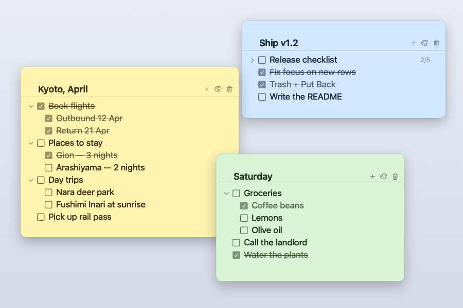

# my-stickies

**Sticky notes for macOS where every note is a nested checklist.** Notes float above your
other windows, indent to any depth with `⇥`, turn translucent when you're not using them, and
save to plain JSON files you own. Native Swift + AppKit/SwiftUI — no dependencies, no Electron,
no account, no Xcode.

[](https://github.com/shastraw-ai/my-stickies/actions/workflows/build.yml)


[](LICENSE)



## Features

- **Checkboxes that nest** — `⇥` tucks a row under the one above it, up to eight levels deep.
  Checking a parent checks its whole subtree; a parent ticks itself once its children are done.
- **Collapse a branch** — a folded row hides its children and shows `2/5` progress instead.
- **Always on top** — every note is a floating panel that stays above other apps, per note (`⌘T`).
- **Transparency** — per-note opacity from 100% down to 20%, plus *turn solid when in use*, so a
  note parked at 30% goes fully readable the moment you point at it and fades back after.
- **Per-note color, font, and size** — seven palettes including a dark one, four font styles, and
  10–26pt, reachable from the note header, a right-click, or the Format menu.
- **Minimize all** — `⇧⌘N` shrinks every note to a small title chip stacked in the
  bottom-right corner; click a chip to open that note back where it was.
- **Recoverable trash** — deleting a note is undoable with **Put Back**; only permanent deletion asks.
- **Plain JSON storage** — one `notes.json` you can read, diff, back up, or drop in a synced
  folder. No database, and nothing to sign into unless you opt in to sync.
- **Optional Google Drive sync** — `⌘R` syncs your notes and trash with your own Drive,
  asking which side wins only when both changed.
- **Keyboard-first outlining** — `⏎`, `⇥`, `⇧⇥`, `↑`/`↓`, `⌫`, and `⌘N` do the whole job.

## Install

```sh
git clone https://github.com/shastraw-ai/my-stickies.git
cd my-stickies
./build.sh --install     # -> /Applications/my-stickies.app
```

`./build.sh` on its own builds to `build/my-stickies.app` without installing. Requires macOS 13+
and the Swift toolchain that ships with the Command Line Tools (`xcode-select --install`) — full
Xcode is not needed.

## Using it

Each note is a window with a title and a checklist. Type in a row and use:

| Key | Does |
| --- | --- |
| `⏎` | New row below, same level |
| `⇥` | Nest under the row above |
| `⇧⇥` | Move back out one level |
| `↑` / `↓` | Move between rows |
| `⌫` on an empty row | Delete the row |
| `⌘N` | New note |
| `⌘W` | Close the note (keeps it — reopen from the Notes menu) |
| `⌘0` | Show every note again |
| `⇧⌘N` | Minimize every note to a title chip |
| `⌘R` | Sync with Google Drive |

Click a checkbox to strike a row through. Checking a parent checks everything under
it; a parent checks itself once all of its children are done. Rows with children get a
chevron — collapse one and it shows a `2/5` progress count instead.

The `✕` on hover deletes a single row (and anything nested under it). The trash button
in the header moves the whole note to the trash, where you can put it back.

## Color, font, and transparency

Every appearance setting is **per-note** and saved with the note. Three ways to reach
them, whichever you find first:

- The **palette button** in the note header — color swatches, font, size slider, and a
  transparency slider in one popover.
- **Right-click anywhere on a note** — Color, Transparency, and Font submenus.
- The **Format menu** in the menu bar, which also has shortcuts:

| Key | Does |
| --- | --- |
| `⌘+` / `⌘-` | Bigger / smaller text |
| `⌥⌘+` / `⌥⌘-` | More opaque / more transparent, in 5% steps |
| `⌘T` | Float this note above other windows |

Transparency runs from 100% down to 20%. It applies to the paper only — the text stays
fully opaque so a see-through note is still readable.

**Turn solid when in use** (on by default) makes a transparent note go fully opaque
while the pointer is over it, or while it's the note you're typing in, then fade back
when you move away. So a note can sit at 30% to stay out of the way and still be
readable the moment you look at it. Turn it off per-note if you'd rather it never
change — it's in the same three places as the other settings.

## Reopening and deleting notes

Closing a note's window (`⌘W` or the red button) puts it away without deleting it.
**Notes ▸ Open Note** lists every note — a checkmark means it's already on screen, and
clicking any of them brings it back where you left it. `⌘0` or clicking the Dock icon
reopens everything at once.

The trash button in a note's header moves it to **Notes ▸ Trash**. That isn't
destructive and doesn't ask for confirmation, because it's reversible: each trashed note
has **Put Back**, which restores it with its colour, transparency, font, position, and
every checkbox intact.

Permanent deletion is separate and does ask: **Delete Permanently…** on a single note, or
**Empty Trash…** for everything. Neither can be undone.

## Syncing with Google Drive

**File ▸ Sync with Google Drive** (`⌘R`) is a manual, one-press sync of `notes.json` and
`trash_notes.json`. The first time, it opens your browser to sign in to Google; the app
asks only for access to files it creates itself, so it can't see anything else in your
Drive. The sign-in is kept in your Keychain, and later syncs need no browser.

Each sync compares both files with how they were at the last sync. Whichever side changed
wins — local edits upload, edits from another Mac download. If both changed (including the
first sync from a second Mac), the notes are merged one by one: notes from either side are
kept, and changes to different notes or different settings of a note combine. If the same
note's text was edited on both, this Mac's version stays and Drive's is kept beside it as
"… (conflicted copy)". **File ▸ Disconnect Google Drive** forgets the sign-in.

## Where your notes live

```
~/Library/Application Support/my-stickies/notes.json        active notes
~/Library/Application Support/my-stickies/trash_notes.json  deleted notes
~/Library/Application Support/my-stickies/drive_sync_state.json  last Drive sync (if used)
~/Library/Application Support/my-stickies/drive_sync_base_*.json  last-synced copies, for merging
```

Both are plain JSON arrays — one entry per note, holding its title, items, colour,
transparency, font, and window frame. Saved half a second after you stop typing and
again on quit. *File → Reveal notes.json in Finder* jumps straight to them.

Set `MY_STICKIES_NOTES=/path/to/other.json` to point the app at a different file — useful
for a separate work/personal set, or for keeping notes in a synced folder. The trash file
is always written beside it, so a set stays together when you copy or sync it.

If the file is ever unreadable, it's renamed to `notes.corrupt-<timestamp>.json` rather
than overwritten, and the app starts fresh.

## Development

```sh
swift build -c release
./.build/release/my-stickies --self-test    # outline logic checks
./tools/make-icon.sh                        # regenerate Resources/AppIcon.icns
```

`swift test` is unavailable here: XCTest ships with Xcode, not the Command Line Tools.
The equivalent assertions live in `Sources/my_stickies/SelfTest.swift` and run through
the `--self-test` flag instead.

`MY_STICKIES_SNAPSHOT=/some/dir` dumps a PNG of each note window 1.5s after launch, for
checking rendering without screen-recording permission.

### Layout

| File | Holds |
| --- | --- |
| `Models.swift` | `Item`, `Note`, palettes, and every outline operation |
| `Store.swift` | Load/save, debounced autosave, new-note placement |
| `NoteWindow.swift` | The floating `NSPanel` and the panel↔store sync |
| `NoteView.swift` | SwiftUI note UI: header, rows, appearance popover |
| `OutlineTextField.swift` | `NSTextField` wrapper for ⇥/⏎/⌫ handling and strikethrough |
| `DriveSync.swift` | Google Drive sync: OAuth sign-in, Drive REST, the sync rule |
| `SelfTest.swift` | Assertions for the outline and sync logic |
| `main.swift` | App delegate and menu bar |

Hierarchy is stored as a **flat array plus a `depth` field**, not a nested tree. Indent,
outdent, delete-with-children, and collapse all become index arithmetic over a
contiguous range — see `descendantRange(of:)` in `Models.swift`.

## License

MIT — see [LICENSE](LICENSE).
